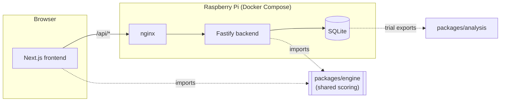

# Moravec

A mental-math training game, rebuilt as a full-stack web app. The player solves timed arithmetic Trials, progresses through Levels, can drill freely in Practice mode, and gets progress synced across devices, logged in or not.

**Live app:** [moravec.elgatoylacaja.com](https://moravec.elgatoylacaja.com), self-hosted on a Raspberry Pi.

---

## The research behind it

Moravec didn't start as a game. Federico Zimmerman (engineering student) and Andrés Rieznik (neuroscientist, his thesis advisor) worked with [El Gato y La Caja](https://elgatoylacaja.com) to turn arithmetic-cognition research into a public Android game. Normally, volunteers did timed mental math in a lab, one session a week. The team bet that a game people wanted to open would collect more and better data than a lab ever could.

It worked. About 500 downloads produced over 120,000 data points in weeks, replicating roughly 30 years of prior lab findings on things like the symmetry advantage (6×6 answered faster than 5×7) and table-neighbor errors (mistaking 6×7 for 48, not for the numerically nearest integer). It won silver at Neurocog 2015.

**Original research write-up:** [elgatoylacaja.com/notas/moravec](https://elgatoylacaja.com/notas/moravec).

This repo is a from-scratch rebuild of that idea as a self-hosted web app. It keeps the original research bet, that a game people want to open beats a tool they're obligated to open, and adds a pipeline that turns played Trials back into analyzable data.

## Architecture

A pnpm monorepo, four packages, one shared domain model:

```
apps/frontend      Next.js App Router, the game itself
apps/backend       Fastify + SQLite for sync, auth, and level content
packages/engine    Shared domain model: Operations, Trial scoring, Level completion
packages/analysis  Python, reproduces the original paper's effects against live trial data
```

`engine` is the important shared piece. Both the client's live scoring and the backend's independent re-validation run the exact same scoring code, imported directly rather than reimplemented twice. In dev, both apps resolve `engine` straight from source, using a `"development"` package export condition plus Turbopack's `transpilePackages`. There's no build step in the loop. Edits hot-reload both apps immediately.



The domain has a deliberately precise vocabulary: Trial vs. TrialResult, Level run vs. LevelStats, Anonymous session vs. OTP login. It's documented in [`CONTEXT.md`](./CONTEXT.md) along with every non-obvious engineering decision and the reasoning behind it, kept as living context rather than a stale ADR pile.

### A few decisions worth calling out

- **Server-side re-validation, not blind trust.** The client submits each Trial's operands, final answer, and total time — not correctness claims. `POST /sync/results` validates that evidence and computes `correct`/`timeExceeded` with the same `engine` scoring used during play; those server-computed values are what the backend stores.
- **Anonymous-first auth.** A player gets a working, syncing identity the moment the app loads: a salted hash of a device ID, no email required. Passwordless OTP login later upgrades that identity in place, merging its history rather than starting fresh. No plaintext email is ever stored.
- **Level content lives in the database, not a frontend map.** Changing a Level's operation mix no longer needs a frontend rebuild. `GET /levels/:levelNumber` is the live source of truth, fetched server-side and threaded down as a prop.
- **Every outcome consumes exactly one Trial slot.** Whether a Trial is correct, wrong, or timed out, a Level is always exactly N Operations, never silently retried. `timeExceeded` is recorded metadata, not a second success condition alongside `correct`.

## Self-hosting on a Raspberry Pi

There's no cloud hosting bill. The whole stack runs on a Raspberry Pi, reachable through a Cloudflare Tunnel rather than port-forwarding:

```
Internet → Cloudflare Tunnel → nginx → frontend (Next.js)
                                     └→ backend (Fastify)  → SQLite (Docker volume)
```

- `docker-compose.yml` runs four services: `backend`, `frontend`, `nginx` (splits `/` → frontend, `/api/*` → backend, one public origin), and `cloudflared`. Cloudflared is the only thing that talks to the outside world; nothing else gets a published host port.
- Deploy is `git pull && docker compose up --build -d`, run directly on the Pi. No CI/CD, no remote-deploy step, no SSH dance, since the repo is checked out on the host itself.
- The SQLite file lives in a named Docker volume, not the container filesystem, so it survives rebuilds.
- Automated DB backups and CI/CD are deliberately deferred. This is a small, self-hosted, single-operator deploy; not every production concern is worth solving on day one.

Full deploy runbook: [`apps/backend/README.md`](./apps/backend/README.md).

## Tech stack

| Layer    | Choices                                                                                                                                                  |
| -------- | -------------------------------------------------------------------------------------------------------------------------------------------------------- |
| Frontend | Next.js 16 (App Router), React 19, TypeScript, Tailwind v4 (theme-token colors, no raw hex), Zustand, TanStack Query, next-intl (en/es)                  |
| Backend  | Fastify 5, TypeScript, `node:sqlite` (no native dependency), Zod, Resend (OTP email)                                                                     |
| Shared   | `packages/engine`, a framework-free domain model built with tsup and consumed as source in dev                                                           |
| Analysis | Python, pandas/jupyter, reproduces the original paper's cognition effects (symmetry advantage, table-neighbor errors) against real production trial data |
| Infra    | Docker Compose, nginx, Cloudflare Tunnel, self-hosted on a Raspberry Pi                                                                                  |
| Quality  | Vitest across every TS package, Husky + lint-staged (Prettier) on commit                                                                                 |

## Local development

```sh
pnpm install                 # also builds packages/engine (postinstall)
pnpm dev:backend              # Fastify on :3000
pnpm dev:frontend             # Next.js dev server, separate terminal

pnpm test                     # every package's test suite
pnpm typecheck
```

Each app needs its own `.env`. See `apps/frontend/.env.example` and `apps/backend/.env.example`. Without `RESEND_API_KEY` set, OTP codes just log to stdout, which is enough to exercise the whole login flow locally.

## Repo layout

```
apps/
  frontend/     Next.js App Router game client
  backend/      Fastify API: auth, sync, level content
packages/
  engine/       Shared domain model + scoring, used by both apps
  analysis/     Python package reproducing the research effects on live data
infra/
  nginx/        Reverse proxy config for the self-hosted deploy
docker-compose.yml   The whole self-hosted stack
CONTEXT.md            Domain language + non-obvious architecture decisions
```
